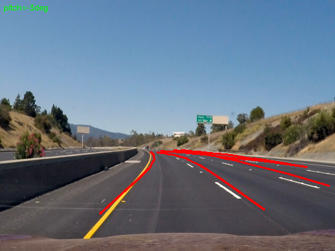
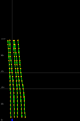

# 🛣️ Anchor3DLane Jetson Inference

This repository contains inference scripts and utilities for running the Anchor3DLane model using ONNX Runtime. The scripts are primarily set up to read video or image data, pass it through an ONNX model, and overlay 3D lane proposals onto 2D frames, as well as generate Bird's Eye View (BEV) visualizations.

### 🖼️ Example Result
<p align="center">
  
  
</p>

## Instructions to Run Files

Before running the scripts, ensure your environment is set up properly:
1. Ensure you have the necessary python packages installed (e.g. `pip install -r requirements.txt`).
2. Make sure the ONNX model is placed at `models/anchor3dlane_raw.onnx`.
3. Provide sample input files such as `videos/input_0.mp4` or `videos/input.mp4`.
4. Run scripts from the root directory of the project.

**To run inference on a video stream:**
```bash
python scripts/infer_video.py
```

**To run inference on a single image:**
*(Note: You can generate the required image using `python scripts/extract_frame.py` first)*
```bash
python scripts/infer_image.py
```

---

## Repository Structure & File Descriptions

Following MLOps best practices, the repository is structured into modular components:

### `src/` - Core Logic
- **`src/inference/postprocess.py`** (formerly `postprocess_raw.py`): Core mathematical utility. Applies softmax, thresholds, NMS, and perspective projections to decode ONNX outputs into pixels.
- **`src/utils/visualization.py`** (formerly `bev_view.py`): Generates a 2D top-down (Bird's Eye View) map of the 3D lane proposals in world space (meters).
- **`src/utils/calibration.py`** (formerly `calibar.py`): Utilities to construct a 3x4 projection matrix (`P_final`) using camera intrinsic matrix, height, and pitch.

### `scripts/` - Executables
- **`scripts/infer_video.py`**: Runs real-time inference on an entire video file, displaying Front View and BEV tracking.
- **`scripts/infer_image.py`**: Fast inference on a single, static image (reads from `data/images/video_frame_60.jpg`).
- **`scripts/tune_calibration.py`**: Tunes camera pitch calibration by looping through angles, generating and projecting onto a frame, then saving to `output/`.
- **`scripts/extract_frame.py`** (formerly `save_frame.py`): Extracts a specific video frame and saves it to `data/images/` for testing.

### `scripts/debug/` - Troubleshooting
- **`scripts/debug/debug_projections.py`** (formerly `debug.py`): Checks the resulting (u, v) pixel coordinate ranges after 3D-to-2D projection to catch flawed projection matrices.
- **`scripts/debug/debug_scores.py`** (formerly `debug_our.py`): Extracts raw confidence scores from the ONNX model before thresholding to diagnose missing lane predictions.

---

## Acknowledgements

- **Model Training & Architecture:** The ONNX model used in this project is based on the [Anchor3DLane](https://github.com/tusen-ai/anchor3dlane) repository and architecture.
- **Dataset:** The model was trained using the [OpenLane dataset](https://github.com/OpenDriveLab/OpenLane).
# 3d-lane-detection-onnx
