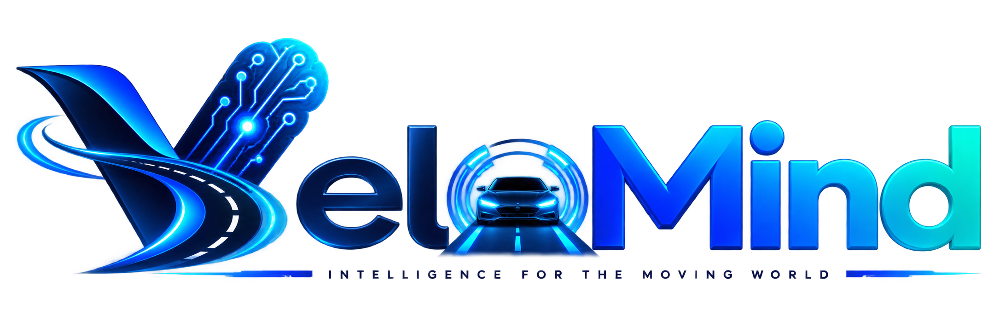

<p align="center">
  
</p>

<p align="center">
  <a href="https://opensource.org/licenses/MIT"></a>
  
  
  
</p>

# Anchor3DLane Jetson Inference & TensorRT + CIPO BEV ADAS

Real-time **3D lane detection** and **CIPO (Closest In-Path Object)** visualization for **NVIDIA Jetson Orin**, with TensorRT engines, YOLO ByteTrack vehicle tracking, monocular depth, and a PySide6 front-camera + Qt Quick 3D BEV dashboard.

The BEV is **lane-anchored**: the ego corridor stays pinned on the canvas, the car and traffic move inside it, and dashed markings scroll from HUD speed (`∫v·dt`). Pose (`c0`, `c1`) is filtered faster than curvature (`c2`, `c3`) so the near field stays responsive without far-field flicker.

**Deployment camera** is the Garmin dashcam clips in `testing_new_videos/` (`GRMN6694`, `GRMN6695`, `GRMN6700`). Frames are stretch-resized to **480×360** after a **20% sky crop** (`src/utils/camera_transform.py`) so OpenLane-trained framing is restored. The P-matrix stays on OpenLane extrinsics (−3° / 1.5 m); crop is source↔model geometry only.

---

## Quick Start

```bash
# 1) One-step setup (system deps, venv, requirements.txt, TensorRT engine)
chmod +x setup.sh
./setup.sh

# 2) Activate venv
source venv/bin/activate

# 3) Run the PySide6 ADAS / BEV app (default video is GRMN6694)
python scripts/run_pyside6_app.py
```

Other useful launchers:

```bash
# Headless GUI smoke test
python scripts/run_pyside6_app.py --test-mode

# Garmin target clips (car / real-time path)
python scripts/run_pyside6_app.py --video testing_new_videos/GRMN6694_540_nohud.mp4
python scripts/run_pyside6_app.py --video testing_new_videos/GRMN6695_540_nohud.mp4
python scripts/run_pyside6_app.py --video testing_new_videos/GRMN6700_540_nohud.mp4

# Custom engine, or legacy QPainter BEV
python scripts/run_pyside6_app.py \
  --video testing_new_videos/GRMN6694_540_nohud.mp4 \
  --model models/anchor3dlane_raw.engine \
  --bev quick3d

# Offline CIPO video pipeline (writes annotated MP4)
python scripts/infer_cipo_pipeline.py \
  --video testing_new_videos/GRMN6694_540_nohud.mp4 \
  --output output/grmn6694_cipo.mp4

# Headless CIPO pipeline
python scripts/infer_cipo_pipeline.py \
  --video testing_new_videos/GRMN6694_540_nohud.mp4 \
  --output output/grmn6694_cipo.mp4 \
  --no-gui

# Lane-only TensorRT video (full-frame resize, no sky crop — not the GUI path)
python scripts/infer_video_tensorrt.py data/images/example_3.mp4

# Single-image TensorRT test
python scripts/infer_tensorrt.py
```

---

## Dependencies

### Python (`requirements.txt`)

Installed automatically by `setup.sh` via `pip install -r requirements.txt`:

| Package | Purpose |
| :--- | :--- |
| `numpy<2.0.0` | Arrays / math |
| `opencv-python-headless>=4.6.0` | Video/image I/O & overlays |
| `pycuda>=2026.1` | CUDA bindings for TensorRT runtime |
| `onnxruntime>=1.18.0` | ONNX fallback / tooling |
| `protobuf>=4.25.0` | ONNX / model protobuf support |
| `flatbuffers>=23.5.26` | Runtime serialization |
| `PySide6>=6.6.0` | ADAS GUI (front cam + BEV) |

Manual install (if not using `setup.sh`):

```bash
source venv/bin/activate
pip install -r requirements.txt
```

> **Jetson note:** `setup.sh` creates the venv with `--system-site-packages` and removes pip `tensorrt` wheels so the system `python3-libnvinfer` is used. YOLO / depth rebuilds may need `ultralytics` (already in `requirements.txt`) and a Jetson-compatible `torch` if you rebuild detectors from `.pt` weights.

### System packages (via `setup.sh`)

`setup.sh` installs (through `apt`):

- `cuda-toolkit`
- `nvidia-tensorrt-dev`, `libnvinfer-bin`, `python3-libnvinfer`
- `python3-opencv`
- `git-lfs`
- `libcurl4-openssl-dev`, `libsqlite3-dev`

---

## What `setup.sh` Does

Detect-and-adapt setup (safe across Jetsons with different CUDA/TensorRT stacks):

1. Detects GPU driver max CUDA, toolkit path, `trtexec`, and system Python TensorRT
2. Installs base APT packages (OpenCV, Git LFS, build deps)
3. Ensures a CUDA toolkit **≤ driver max CUDA** (does not force a newer toolkit)
4. Reuses system TensorRT when present; otherwise installs `libnvinfer-bin` + `python3-libnvinfer` (avoids conflicting `nvidia-tensorrt-dev` when possible)
5. Creates `venv` with `--system-site-packages` so system TensorRT/OpenCV are visible
6. Installs `requirements.txt`, then removes any pip TensorRT wheels that would shadow system TRT
7. Verifies imports, then builds missing engines: lane, MiDaS depth, YOLO

```bash
chmod +x setup.sh
./setup.sh
```

---

## TensorRT Engine Build

If the engine is missing or you need to rebuild for this Orin:

```bash
trtexec --onnx=models/anchor3dlane_raw.onnx \
        --saveEngine=models/anchor3dlane_raw.engine \
        --fp16
```

Benchmark:

```bash
trtexec --loadEngine=models/anchor3dlane_raw.engine \
        --shapes=img:1x3x360x480,mask:1x1x360x480 \
        --iterations=100
```

Expected models for the full PySide6 pipeline:

- `models/anchor3dlane_raw.engine` — 3D lanes
- `models/yolov8n.engine` — YOLOv8-nano vehicles (ByteTrack, imgsz=640)

Compile YOLO for this Orin (backs up the previous engine):

```bash
source venv/bin/activate
python scripts/export_yolo_orin.py --imgsz 640
```
- `models/monocular_depth.engine` — depth (optional path)

---

## BEV and camera notes

| Piece | What it does |
| :--- | :--- |
| `src/tracking/lane_frame.py` | Pins the lane, measures ego offset/yaw from the corridor cubic, scrolls dashes from speed |
| `src/ui/bev_quick3d.py` + `src/ui/qml/BevScene.qml` | Qt Quick 3D BEV; ego `egoX` / `egoYawDeg`; no static ±5.35 m fallback edges |
| `src/utils/camera_transform.py` | Default `SKY_CROP_FRAC = 0.20` then resize to 480×360 |
| `src/utils/ego_speed.py` | HUD OCR speed for dash scroll and EKF coast |

Do **not** nudge the sky crop down toward 10% without re-running the sweep: that band collapses recall on the Garmin clips. Past ~25% the model's 3D lane width starts to collapse.

Verify a clip through the real QML widget (needs a detection cache first):

```bash
python scripts/debug/bev_poc_tune.py --cache          # once
python scripts/debug/bev_qt3d_verify.py --metrics --video GRMN6695_540_nohud.mp4
python scripts/debug/crop_sweep.py                    # sky-crop vs corridor quality
python scripts/debug/width_bias_probe.py              # raw ego-pair width vs 12 ft truth
```

---

## Repository Layout (high level)

```text
3d-lane-detection-onnx/
├── data/                 # Example videos, 3D assets
├── testing_new_videos/   # Garmin dashcam targets (GRMN6694 / 6695 / 6700)
├── models/               # ONNX / TensorRT engines
├── scripts/
│   ├── run_pyside6_app.py          # Main GUI launcher
│   ├── infer_cipo_pipeline.py      # Uses CameraTransform (sky crop)
│   ├── export_yolo_orin.py
│   ├── infer_video_tensorrt.py
│   └── debug/                      # BEV tune / QML verify / crop & width probes
├── src/
│   ├── ui/               # PySide6 + Qt Quick 3D BEV
│   ├── inference/        # TRT / CIPO / YOLO / depth
│   ├── tracking/         # RoadStateEstimator + LaneFrameModel
│   └── utils/            # CameraTransform, ego speed, calibration
├── requirements.txt
├── setup.sh
└── README.md
```

---

## Merge This Branch Into `main`

Current feature branch example: `Asphalt_view`.

### Option A — merge locally, then push `main`

```bash
# On your feature branch: commit & push first if needed
git checkout Asphalt_view
git status
git push -u origin Asphalt_view

# Merge into main
git checkout main
git pull origin main
git merge Asphalt_view

# Resolve conflicts if any, then:
git push origin main
```

### Option B — GitHub Pull Request (recommended)

```bash
git checkout Asphalt_view
git push -u origin Asphalt_view

gh pr create --base main --head Asphalt_view \
  --title "Asphalt BEV UI + CIPO dashboard updates" \
  --body "Cinematic BEV road, Anchor3D lane toggle, calibration defaults, FPS fixes."

# After review:
gh pr merge --merge
```

### After merge — sync feature branch (optional)

```bash
git checkout Asphalt_view
git merge main
git push origin Asphalt_view
```

---

## Acknowledgements

- **Model:** [Anchor3DLane](https://github.com/tusen-ai/anchor3dlane)
- **Dataset:** [OpenLane](https://github.com/OpenDriveLab/OpenLane)

---

## License

This project is licensed under the **MIT License** — see the [LICENSE](LICENSE) file for details.

Feel free to use, modify, and distribute this software as permitted by the MIT License.
