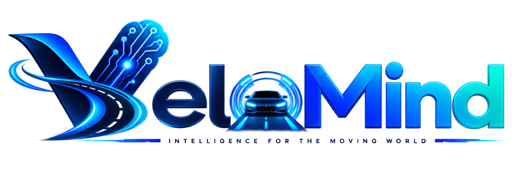
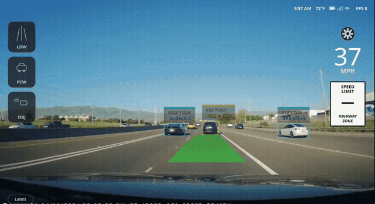
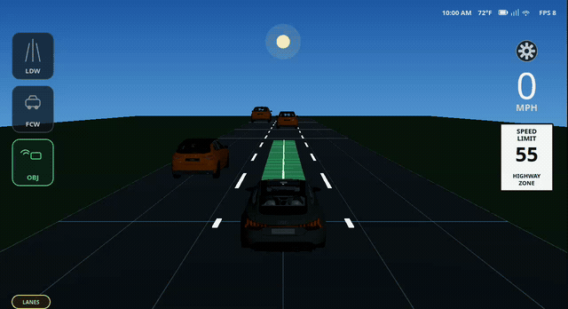

<p align="center">
  
</p>

<p align="center">
  <a href="https://opensource.org/licenses/MIT"></a>
  
  
  
</p>

# 3D Lane Detection and CIPO BEV ADAS for NVIDIA Jetson

This repository provides a real-time perception and visualization stack for **NVIDIA Jetson Orin**. It performs **3D lane detection**, **closest-in-path object (CIPO)** visualization, YOLO ByteTrack vehicle tracking, traffic-sign intelligent speed assistance (ISA), US LPRNet speed-limit OCR, and lane-departure / forward-collision (LDW / FCW) alerts. Results are shown in a PySide6 front-camera view and a Qt Quick 3D bird’s-eye (BEV) dashboard, with inference on TensorRT engines.

This software is **SAE Level 0** driver assistance: it informs and warns. It does **not** steer, brake, accelerate, or otherwise control the vehicle. The driver remains fully responsible for operation at all times. The stack is intended for research, demonstration, and development, not as a certified production ADAS.

The BEV is lane-anchored: the ego corridor remains fixed on the canvas while the vehicle and surrounding traffic move within it. Dashed markings scroll from HUD speed (`∫v·dt`). Lateral pose (`c0`, `c1`) is filtered more aggressively than curvature (`c2`, `c3`) so the near field stays responsive without far-field flicker.

Input frames are cropped **20%** from the top (sky) and stretch-resized to **480×360** (`src/utils/camera_transform.py`) to restore OpenLane-trained framing. The projection matrix uses OpenLane extrinsics (−3° / 1.5 m); the crop maps source geometry to the model and does not change those extrinsics.

<table>
  <tr>
    <td align="center" width="50%">
      
      <br/>
      <b>Live view</b> — front camera, lanes, and warnings
    </td>
    <td align="center" width="50%">
      
      <br/>
      <b>BEV</b> — lane-anchored bird’s-eye view
    </td>
  </tr>
</table>

## Quick Start

```bash
# 1) One-step setup (system deps, venv, requirements.txt, TensorRT engines from ONNX)
chmod +x setup.sh
./setup.sh

# Rebuild engines from ONNX already in models/ (skips APT / venv)
# ./setup.sh --rebuild-engines

# 2) Activate venv
source venv/bin/activate

# 3) Run the 8-second demo clip (cut from data/images/clip.mp4)
python scripts/run_pyside6_app.py --video data/demo/clip_8s.mp4

# Run on your own video
python scripts/run_pyside6_app.py --video <video_path>

# Custom engine
python scripts/run_pyside6_app.py \
  --video <video_path> \
  --model models/anchor3dlane_raw.engine \
  --bev quick3d
```

---

## If these scripts don't work

Open **[MANUAL.md](MANUAL.md)** and start at **Help**. That section routes you by what failed; the rest of the manual is reference (dependencies, `setup.sh`, TensorRT builds, BEV/camera, layout, merging).

| What failed | Read |
| :--- | :--- |
| `./setup.sh` errors, missing packages, or TensorRT / import failures | [Help → Setup](MANUAL.md#setup-fails) |
| App runs but lanes, vehicles, or signs are missing (no `.engine`) | [Help → Engines](MANUAL.md#engines-missing-or-wont-build) |
| Lanes, corridor width, or the BEV look wrong | [Help → Camera and BEV](MANUAL.md#lanes-or-bev-look-wrong) |
| You need the repo map or how to merge into `main` | [Layout](MANUAL.md#repository-layout) · [Merge](MANUAL.md#merge-this-branch-into-main) |

---

## Acknowledgements

- **Model:** [Anchor3DLane](https://github.com/tusen-ai/anchor3dlane)
- **Dataset:** [OpenLane](https://github.com/OpenDriveLab/OpenLane)

---

## License

This project is licensed under the **MIT License** — see the [LICENSE](LICENSE) file for details.

Feel free to use, modify, and distribute this software as permitted by the MIT License.
